Prise en main CI/CD
Part 1
1) Préparer le dépôt local et version 1
# init git
git init
git add .
git commit -m "Version 1"
[Description de l'image](img/initgit.png)

# créer et basculer sur la branche dev
git branch -M main
git checkout -b dev
[Description de l'image](img/dev.png)

--
2) Créer le dépôt GitHub Pages
git remote add origin https://github.com/rouissinour464/rouissinour464.github.io.git

git push origin main
git push origin dev
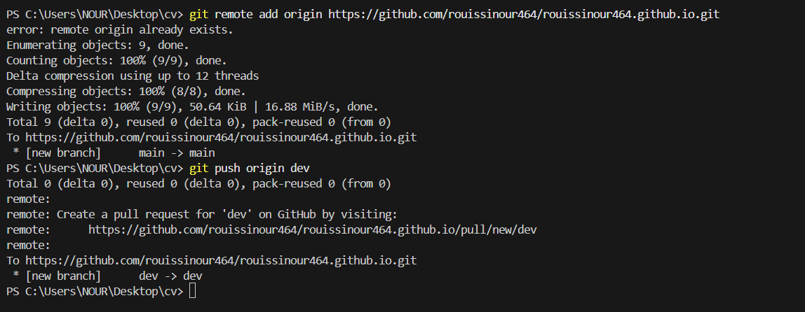
--
4) Dockerfile — conteneuriser ton CV
fichier dockerfile
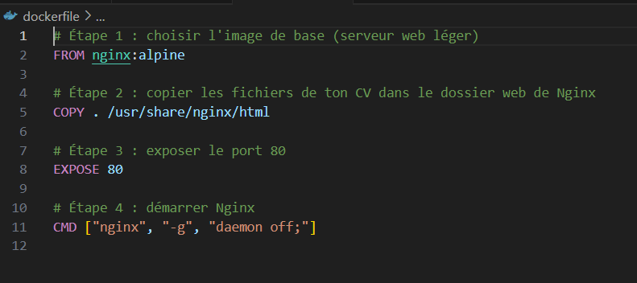

# build
docker build -t nour292/cv:v1 .
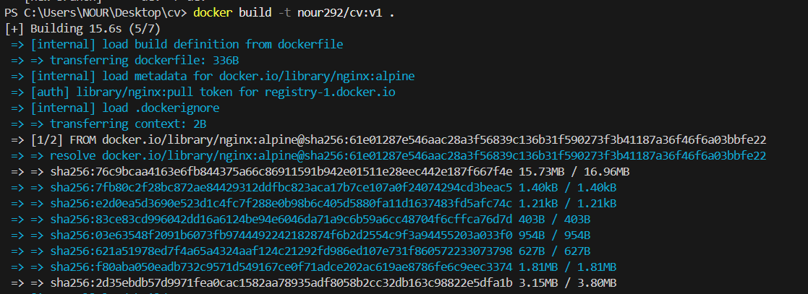
# login (si pas déjà connecté)
docker login
# push
docker push nour292/cv:v1
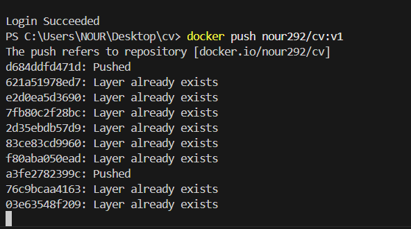

--
6) docker-compose.yml (expose port 8005)
fichier docker compose
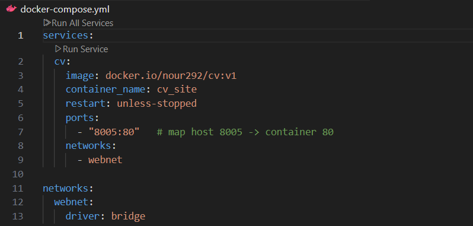

Lancement : docker compose up -d
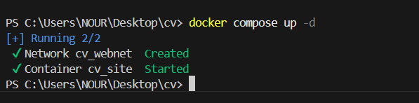

->Cela démarre ton site dans un conteneur, accessible sur http://localhost:8005.
Ouvre ton navigateur sur : http://localhost:8005
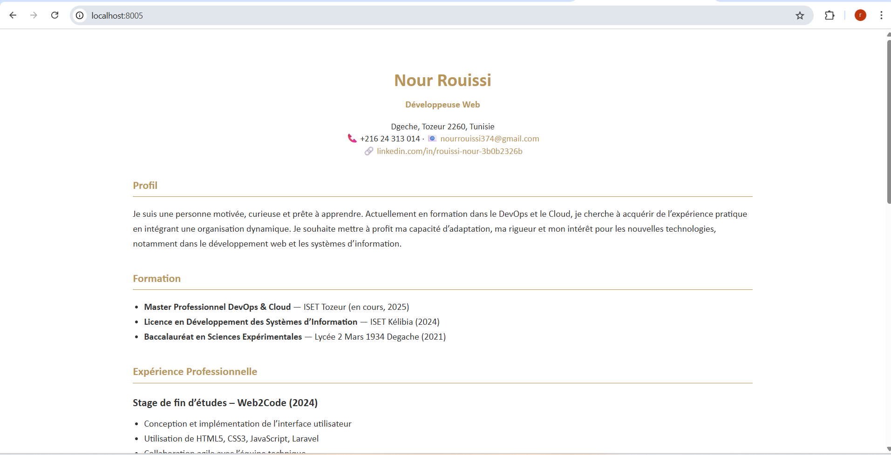
--------------
part2
1)Installer K3S: 
# sur controller
curl -sfL https://get.k3s.io | sh -s - server 
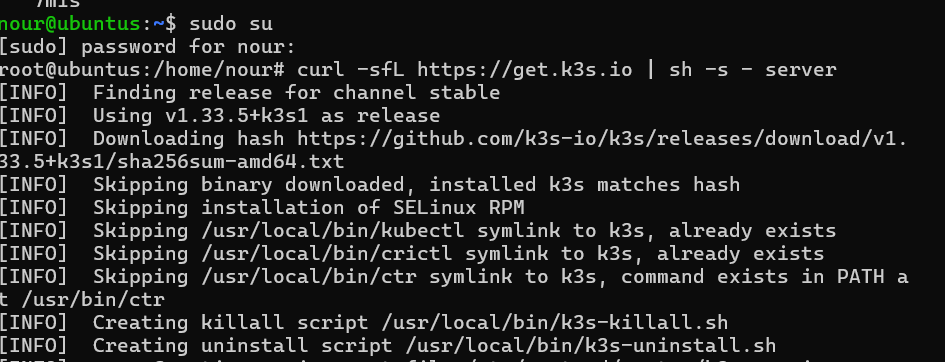
--write-kubeconfig-mode 644
Après installation, récupère le token pour joindre agents :sudo cat /var/lib/rancher/k3s/server/node-token
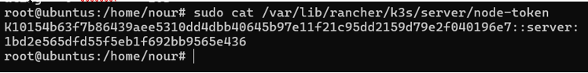
----
2)Installer K3S — Agents (sur chaque worker)
curl -sfL https://get.k3s.io | K3S_URL=https://192.168.1.21:6443 K3S_TOKEN=<TON_TOKEN> K3S_NODE_NAME=worker1 sh - 
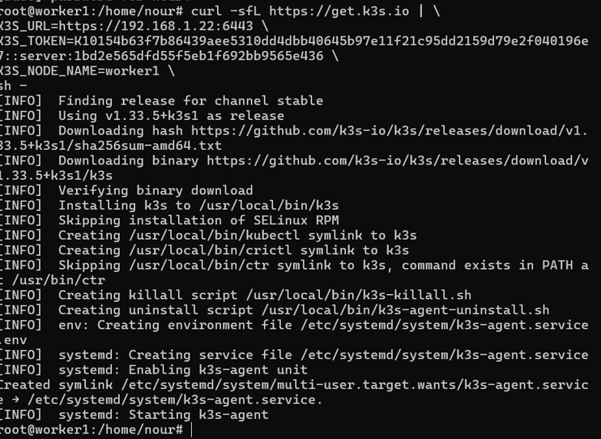
sur le controller: kubectl get nodes
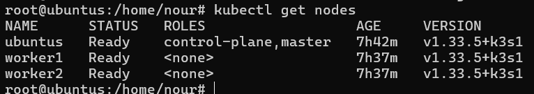
-----
3)Configurer kubectl sur ta machine physique (si tu veux contrôler K3S depuis l'hôte
# sur controller: afficher le kubeconfig
sudo cat /etc/rancher/k3s/k3s.yaml
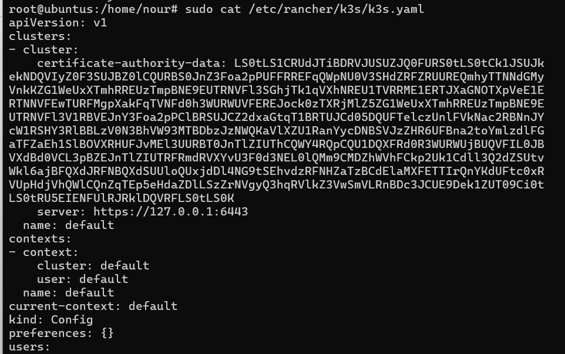
# copie son contenu vers ta machine (ex: via scp)
scp /etc/rancher/k3s/k3s.yaml user@host:/home/user/.kube/config
Édite le fichier k3s.yaml et remplace 127.0.0.1 par l'IP du controller (ex: 192.168.1.10) pour qu'il soit utilisable depuis ta machine :# dans k3s.yaml: change server: https://127.0.0.1:6443 to https://<CONTROLLER_IP>:6443
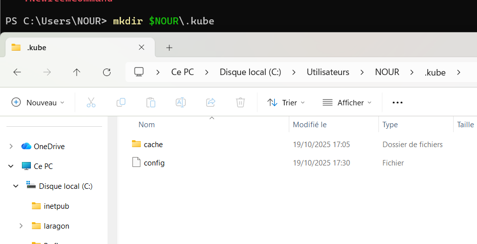
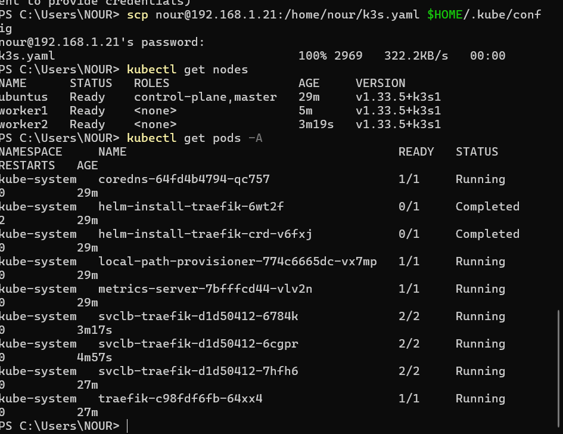
Puis teste :kubectl get nodes
kubectl get pods -A
----
4)Manifests Kubernetes (cv-deployment.yaml et cv-service.yaml)

cv-deployment.yaml
apiVersion: apps/v1
kind: Deployment
metadata:
  name: cv-deployment
  labels:
    app: cv
spec:
  replicas: 2
  selector:
    matchLabels:
      app: cv
  template:
    metadata:
      labels:
        app: cv
    spec:
      containers:
        - name: cv
          image: nour292/cv:v1
          ports:
            - containerPort: 80

cv-service.yaml (NodePort = 30006) :
apiVersion: v1
kind: Service
metadata:
  name: cv-service
spec:
  type: NodePort
  selector:
    app: cv
  ports:
    - port: 80
      targetPort: 80
      nodePort: 30006
Après création :kubectl apply -f cv-deployment.yaml
kubectl apply -f cv-service.yaml

kubectl get svc cv-service -o wide
kubectl get pods -l app=cv
Accès depuis un navigateur : http://<NODE_IP>:30006

[Description de l'image](img/test.png)